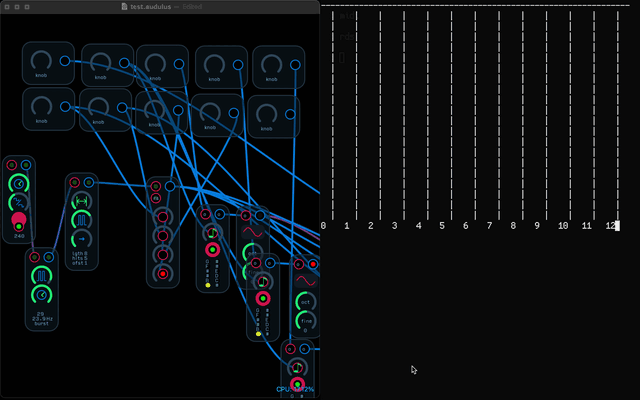

Visual MIDI CC
==============

A vi-like MIDI continuous controller
------------------------------------

Vi MIDI CC is a vi-like controller of [SendMidi's](https://github.com/gbevin/sendmidi) 'cc' command. This is not yet a responsive and accurate music controller. This is a handy tiny tool for tiny fast jobs. One might use it for things like EQ on a headless music server.

Features
 - sends 128 different midi cc values 
 - one vi-style key recording register for on-the-fly macros (more registers coming)
 - saves and opens cc values to and from ./values.txt

Installation
 - Install SendMidi - Thanks Geert!
   - [SendMidi](https://github.com/gbevin/sendmidi)
 - Building
   - `make main`

Setup
 - Make a virtual midi instrument.
   - MacOS
     - open Audio\ Midi\ Setup.app
     - Window -> Show MIDI Studio
     - open "IAC Driver"
     - check "Device is online"

Usage
 - `builds/main <absolute path to SendMidi binary> <fader height>`
    - eg `builds/main /usr/bin/sendmidi 20`
 - Keys
   - Navigation: h, j, k, l
   - Move a fader
     - Relatively: J, K
     - Absolutely: H, M, L
   - Command line: :
   - Start, stop recording: q
   - Play recording: @
   - Quit command: :q

